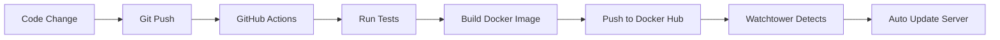

# 🚀 Quick Start Guide - Project 14 Deployment

This is a condensed version of the full deployment process. For detailed instructions, see [DEPLOYMENT.md](./DEPLOYMENT.md).

## ⚡ 10-Minute Setup Checklist

### 1. Prerequisites ✅
- [ ] GitHub account created
- [ ] Docker Hub account created ([hub.docker.com](https://hub.docker.com/))
- [ ] Digital Ocean account ($7/mo or free with [GitHub Student Pack](https://education.github.com/pack))
- [ ] Domain name obtained (optional but recommended)

### 2. Docker Hub Configuration (5 minutes)

```bash
# 1. Create Docker Hub account at hub.docker.com
# 2. Create Access Token: Account Settings → Security → New Access Token
# 3. Save your Docker Hub username and token
```

### 3. GitHub Secrets (2 minutes)

```bash
# Go to: https://github.com/YOUR_USERNAME/project14/settings/secrets/actions
# Add two secrets:
#   DOCKER_USERNAME = your Docker Hub username
#   DOCKER_PASSWORD = your Docker Hub access token
```

### 4. Push to GitHub (1 minute)

```powershell
# In your project directory
git add .
git commit -m "Add production deployment configuration"
git push origin main

# Watch build at: https://github.com/YOUR_USERNAME/project14/actions
```

### 5. Server Setup (15 minutes)

```bash
# Create Digital Ocean Droplet:
# - Ubuntu 24.04 LTS
# - $7/month (1GB RAM)
# - Enable SSH keys

# Connect to server
ssh root@YOUR_SERVER_IP

# Quick setup script
curl -fsSL https://raw.githubusercontent.com/kaw393939/mywebclass_hosting/master/scripts/quick-setup.sh | bash

# Or manual setup:
apt update && apt upgrade -y
apt install -y docker.io docker-compose git ufw
ufw allow 22 && ufw allow 80 && ufw allow 443
ufw --force enable
```

### 6. Deploy Application (5 minutes)

```bash
# On your server
mkdir -p ~/project14 && cd ~/project14

# Create .env file (REPLACE PLACEHOLDERS!)
cat > .env << 'EOF'
DOCKER_USERNAME=your-dockerhub-username
DATABASE_URL=postgresql://postgres:STRONG_PASSWORD@db:5432/fastapi_db
TEST_DATABASE_URL=postgresql://postgres:STRONG_PASSWORD@db:5432/fastapi_test_db
POSTGRES_USER=postgres
POSTGRES_PASSWORD=STRONG_PASSWORD
POSTGRES_DB=fastapi_db
JWT_SECRET_KEY=$(openssl rand -hex 32)
JWT_REFRESH_SECRET_KEY=$(openssl rand -hex 32)
ACCESS_TOKEN_EXPIRE_MINUTES=30
REFRESH_TOKEN_EXPIRE_DAYS=7
BCRYPT_ROUNDS=12
DOMAIN=your-domain.com
EMAIL=your-email@example.com
PGADMIN_DEFAULT_EMAIL=admin@example.com
PGADMIN_DEFAULT_PASSWORD=STRONG_ADMIN_PASSWORD
EOF

# Generate secrets
echo "JWT_SECRET_KEY=$(openssl rand -hex 32)" >> .env
echo "JWT_REFRESH_SECRET_KEY=$(openssl rand -hex 32)" >> .env

# Download configuration
curl -o docker-compose.yml https://raw.githubusercontent.com/YOUR_USERNAME/project14/main/docker-compose.prod.yml
curl -o Caddyfile https://raw.githubusercontent.com/YOUR_USERNAME/project14/main/Caddyfile

# Start application
docker compose up -d

# Check status
docker compose ps
docker compose logs -f web
```

### 7. Configure Domain (10 minutes)

```bash
# In your domain DNS settings:
# Add A record: @ → YOUR_SERVER_IP
# Add A record: www → YOUR_SERVER_IP

# Wait for DNS propagation (5-60 minutes)
# Test: nslookup your-domain.com

# Access: https://your-domain.com
```

## ✅ Verification

```bash
# Test health endpoint
curl http://YOUR_SERVER_IP:8000/health

# Should return: {"status":"healthy"}

# Check all services
docker compose ps

# All should show "Up" and "healthy"
```

## 🔄 How Auto-Deployment Works



1. **Make changes** to your code
2. **Commit and push** to GitHub
3. **GitHub Actions** runs tests automatically
4. **If tests pass**, builds Docker image
5. **Pushes image** to Docker Hub
6. **Watchtower** on server detects new image (every 5 minutes)
7. **Automatically pulls** and deploys new version
8. **Zero downtime** - rolling update

## 🛠️ Common Commands

```bash
# View logs
docker compose logs -f web

# Restart app
docker compose restart web

# Stop everything
docker compose down

# Start everything
docker compose up -d

# Update manually
docker compose pull && docker compose up -d

# Backup database
docker compose exec db pg_dump -U postgres fastapi_db > backup.sql
```

## 🚨 Troubleshooting Quick Fixes

### App Won't Start
```bash
docker compose logs web
docker compose restart web
```

### HTTPS Not Working
```bash
# Check DNS
nslookup your-domain.com

# Check Caddy
docker compose logs caddy

# Restart Caddy
docker compose restart caddy
```

### Database Issues
```bash
# Check database
docker compose logs db

# Restart database
docker compose restart db
```

### Watchtower Not Updating
```bash
# Check Watchtower logs
docker compose logs watchtower

# Force update
docker compose pull && docker compose up -d
```

## 📚 Full Documentation

For complete details, security hardening, and advanced configuration:
- See [DEPLOYMENT.md](./DEPLOYMENT.md)
- Follow [mywebclass_hosting guide](https://github.com/kaw393939/mywebclass_hosting)

## 🎯 What You've Built

✅ **Production-Ready Application**
- FastAPI backend with PostgreSQL
- Automatic HTTPS with Caddy
- Auto-updates with Watchtower
- CI/CD with GitHub Actions

✅ **Security**
- Firewall configured (UFW)
- HTTPS encryption
- Non-root Docker user
- Environment variable secrets

✅ **DevOps Skills**
- Docker containerization
- Reverse proxy setup
- CI/CD pipeline
- Production deployment

## 🏆 Portfolio-Ready

This setup demonstrates:
- Full-stack development
- DevOps automation
- Security best practices
- Production deployment
- Cloud infrastructure

**Perfect for résumés and interviews!**

---

**Next Steps:**
1. Customize the application
2. Add more features
3. Implement monitoring
4. Set up log aggregation
5. Add database backups automation

For detailed guides on these topics, see the [mywebclass_hosting repository](https://github.com/kaw393939/mywebclass_hosting).
